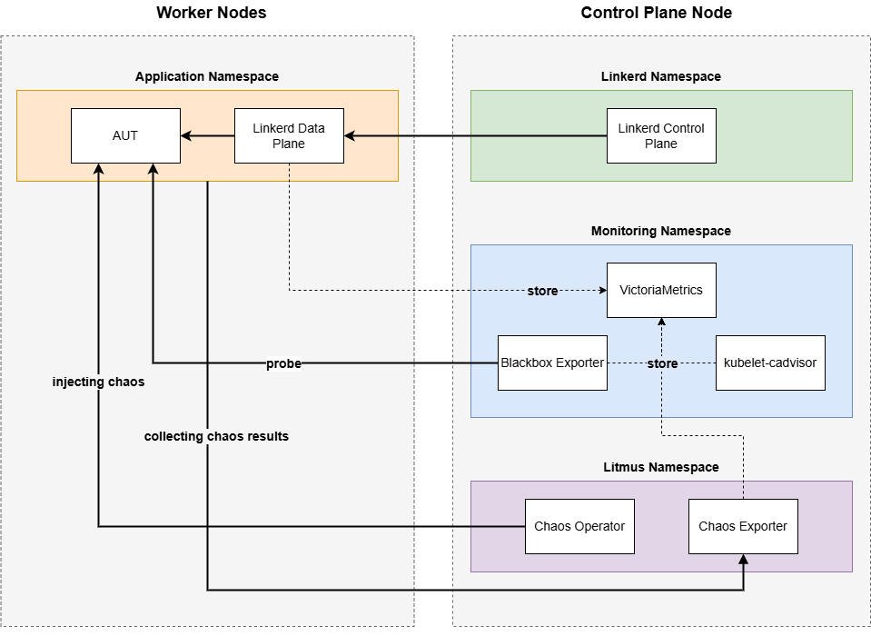

# SRE Core Orchestrator

SRE Core Orchestrator is the backend and execution platform for running chaos engineering experiments against Kubernetes-based application environments. It provisions test clusters, deploys workloads, injects controlled failures with LitmusChaos, observes service behavior, and stores experiment and evaluation results for later analysis.

The project combines a FastAPI backend, Celery background workers, a Go orchestration agent, and infrastructure integrations for Multipass and k3s.

## Features

- REST API for users, clusters, deployments, chaos experiments, campaigns, metrics, and evaluations.
- Asynchronous experiment and provisioning jobs with Celery and RabbitMQ.
- Multipass-based virtual machine provisioning.
- k3s cluster bootstrapping and Kubernetes workload management.
- Linkerd service-mesh installation and traffic/latency observation.
- LitmusChaos experiment execution and probe collection.
- VictoriaMetrics, kube-state-metrics, and Blackbox Exporter based monitoring templates.
- PostgreSQL persistence with SQLAlchemy and Alembic migrations.
- Evaluation indicators and analytical datasets for reliability research.

## Architecture and Components



| Component                 | Version or source                                                   | Role                                |
| ------------------------- | ------------------------------------------------------------------- | ----------------------------------- |
| Python                    | 3.12.1 in the Docker image; project requires `>=3.12`               | Backend and pipeline runtime        |
| FastAPI                   | `>=0.109.0`                                                         | HTTP API                            |
| SQLAlchemy                | `>=2.0.25`                                                          | Database access                     |
| Alembic                   | `>=1.13.1`                                                          | Database migrations                 |
| PostgreSQL                | Version is deployment-specific                                      | Persistent storage                  |
| Celery                    | `>=5.3.6`                                                           | Background task execution           |
| RabbitMQ                  | `rabbitmq:3-management-alpine`                                      | Celery broker                       |
| Go                        | `1.22.2`                                                            | Orchestration agent toolchain       |
| Multipass                 | Host-installed, version is deployment-specific                      | VM lifecycle management             |
| k3s                       | Installed from `https://get.k3s.io`, version is deployment-specific | Lightweight Kubernetes distribution |
| Kubernetes Python clients | `>=29.0.0`                                                          | Kubernetes API access               |
| Linkerd                   | Installed from the Linkerd installer at image build time            | Service mesh and traffic telemetry  |
| LitmusChaos               | `3.27.0`                                                            | Chaos experiment framework          |
| Litmus runner             | `litmuschaos/go-runner:3.27.0`                                      | Experiment execution                |
| Litmus exporter           | `litmuschaos/chaos-exporter:3.28.0`                                 | Chaos metrics export                |
| VictoriaMetrics           | `victoriametrics/victoria-metrics:v1.108.1`                         | Time-series metrics storage         |
| kube-state-metrics        | `v2.14.0`                                                           | Kubernetes object metrics           |
| Blackbox Exporter         | `prom/blackbox-exporter:v0.25.0`                                    | Endpoint probing                    |
| Nginx                     | `1.25-alpine`                                                       | HTTP reverse proxy                  |
| Docker CLI                | `27.5.1` in application images                                      | Container operations from workers   |
| Helm, Skaffold, Kustomize | Latest release downloaded during image build                        | Kubernetes deployment tooling       |

Versions marked as deployment-specific or latest are not pinned by this repository. For reproducible production deployments, pin those versions in the host provisioning and Docker build process.

## Requirements

- Linux host with Docker and Docker Compose v2.
- A running PostgreSQL instance reachable using the `POSTGRES_*` settings. PostgreSQL is intentionally not defined in the supplied Compose files.
- GNU Make, or equivalent direct `docker compose` commands.
- For cluster provisioning: Multipass, SSH access, and a host capable of running the selected Multipass VMs.
- For local Python development: Python 3.12+ and `uv`.
- For local Go agent development: Go 1.22.2 or compatible Go 1.22.x.

## Quick Start with Docker Compose

1. Clone the repository and enter its directory:

   ```bash
   git clone https://github.com/clarkkiee/sre-core-orchestrator.git
   cd sre-core-orchestrator
   ```

2. Create the environment file and fill in the database, RabbitMQ, Kubernetes, SSH, and agent settings:

   ```bash
   cp .env.example .env
   ```

   On Windows PowerShell, use `Copy-Item .env.example .env` instead of `cp`.

3. Make sure PostgreSQL is running and that `POSTGRES_HOST` resolves from the API and worker containers. The default container startup script waits for PostgreSQL and RabbitMQ before starting.

4. Start the development stack:

   ```bash
   make dev-up-build
   ```

   Equivalent Docker Compose command:

   ```bash
   docker compose -f docker-compose.yml -f docker-compose.dev.yml up --build -d
   ```

5. Apply database migrations:

   ```bash
   make alembic-upgrade
   ```

6. Check the API:
   - Health endpoint: <http://localhost:8000/api/v1/health>
   - Swagger UI: <http://localhost:8000/docs>
   - ReDoc: <http://localhost:8000/redoc>
   - RabbitMQ management UI: <http://localhost:15672>

Default RabbitMQ credentials come from `RABBITMQ_USER` and `RABBITMQ_PASSWORD` in `.env`. Do not use development defaults in production.

## Production Compose

Configure production secrets and external services in `.env`, then run:

```bash
make prod-up-build
```

The production overlay enables the production image, four API workers, two Celery replicas, resource limits, restart policies, and optional Nginx TLS mounts. Review the Compose and Nginx configuration before exposing the service publicly.

Stop the stack with:

```bash
make down
```

## Local Development

Install the project and development dependencies with `uv`:

```bash
uv venv
uv pip install -e ".[dev]"
```

Run the API locally:

```bash
uvicorn app.main:app --reload --host 0.0.0.0 --port 8000
```

Build the Go agent:

```bash
cd agent
go build -o bin/orchestrator-agent .
```

For a Linux AMD64 agent binary:

```bash
make build-linux
```

## Database Commands

The Makefile runs migration commands inside the development API container:\*\*\*\*

```bash
make alembic-upgrade
make alembic-history
make alembic-downgrade
make alembic-revision msg="describe the migration"
make seed-admin count=1
```

Review autogenerated migrations before applying them to a shared database.

The repository also contains focused tests for the metrics client, black-box exporter, and evaluation inference pipeline.

## Project Structure

```text
.
├── app/                         # Main FastAPI application package
│   ├── db/                      # Database session, models, and seeders
│   ├── exceptions/              # Application exception definitions
│   ├── infrastructure/          # Kubernetes, chaos, Linkerd, and cluster providers
│   ├── models/                  # SQLAlchemy domain models
│   ├── repositories/            # Database access layer
│   ├── routers/                 # Versioned REST API routes
│   ├── schemas/                 # API request and response schemas
│   ├── services/                # Application and evaluation services
│   ├── tasks/                   # Celery background tasks
│   └── main.py                  # FastAPI application entry point
├── agent/                       # Go orchestration agent
│   ├── internal/                # Agent API, executor, k3s, Multipass, and store code
│   ├── main.go                  # Agent entry point
│   └── Makefile                 # Agent build commands
├── alembic/                     # Database migration environment
├── config/                      # Cluster, experiment, and monitoring configuration
│   ├── experiments/             # LitmusChaos experiment definitions
│   ├── templates/               # Litmus and monitoring manifest templates
│   └── values/                  # Default component image versions and settings
├── data/                        # Dataset documentation and compressed datasets
├── docker/                      # Nginx and backend container support files
├── scripts/                     # Container entrypoint and setup scripts
├── Dockerfile                   # Development and production multi-stage image
├── Makefile                     # Project setup, Compose, and migration commands
├── docker-compose.yml           # Base service definitions
├── docker-compose.dev.yml       # Development Compose overrides
├── docker-compose.prod.yml      # Production Compose overrides
└── pyproject.toml               # Python package metadata and tool configuration
```

## Configuration

`.env.example` documents the main settings. Important groups include:

- `POSTGRES_*`: PostgreSQL connection pool and database settings.
- `RABBITMQ_*` and `CELERY_*`: task broker and result backend settings.
- `KUBECONFIG`: Kubernetes client configuration.
- `CLUSTER_PROVIDER`: cluster provider, typically `multipass_k3s`.
- `MULTIPASS_*`, `SSH_*`, and `AGENT_*`: remote VM and Go agent execution.
- `PROMETHEUS_URL`: metrics endpoint configuration.

## Data and Releases

Dataset archives are documented in [data/README.md](data/README.md) and are attached to the GitHub release [v1.0.0](https://github.com/clarkkiee/sre-core-orchestrator/releases/tag/v1.0.0). Each archive contains a CSV file and has a corresponding SHA-256 checksum in `data/gzip/SHA256SUMS.txt`.

## Compatibility Notes

This platform already tested and simulated in the Linux (Ubuntu) environment. The use of other operating systems as hosts for running the platform has not been fully tested, and there are several components specifically designed for the Linux (Ubuntu) environment. The author **strongly recommends** using Ubuntu to run all orchestrator components.

## License

This project declares the **MIT License** in `pyproject.toml`. See the repository metadata for the current license terms.

## Authors

- Aloysius Juan Farrel Lumentut ([@clarkkiee](https://github.com/clarkkiee))

## Repository

<https://github.com/clarkkiee/sre-core-orchestrator>
